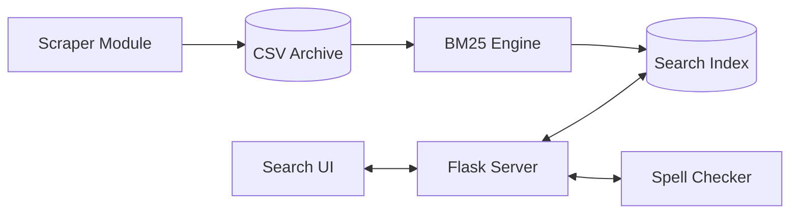

# SmartSearch Pro: Advanced Information Retrieval System

SmartSearch Pro is a high-performance, scalable news search engine designed to demonstrate modern information retrieval techniques. The system aggregates real-time data from global news agencies, processes it through a professional-grade pipeline, and provides ranked results using the BM25 probabilistic model.

## System Architecture



## Core Features

### 1. Data Ingestion Pipeline
The system automates the collection of data from over 50 global RSS feeds, including Reuters, BBC, NASA, and Wired. It implements strict title-based deduplication to maintain a high-quality, unique corpus of over 1,300 documents.

### 2. Search Engine Core (BM25)
Unlike traditional TF-IDF models, this system utilizes the BM25 (Best Matching 25) algorithm. This provides superior relevance by addressing term frequency saturation and normalizing for document length variations.

### 3. Advanced Preprocessing
Every document and query undergoes a rigorous transformation process:
- Normalization: Case folding and special character removal.
- Tokenization: Precise regex-based word extraction.
- Stop Word Filtering: Elimination of non-semantic terms.
- Stemming: Algorithmic suffix stripping to reduce words to their base forms.

### 4. Intelligent Query Correction
Integrated spell-checking functionality analyzes user input against the indexed dictionary using string similarity algorithms, providing "Did you mean?" suggestions to enhance user experience.

## Project Structure

```text
.
├── app.py                  # Flask web server and API routes
├── engine.py               # Core IR engine (BM25, Indexing, Preprocessing)
├── data_collector.py       # Orchestrator for the data ingestion pipeline
├── scraper.py              # Web scraping module for global news sources
├── spell_checker.py        # String similarity and query suggestion logic
├── evaluator.py            # Performance auditing and metrics suite
├── index.json              # Persistent Inverted Index storage
├── public_dataset.csv      # Master archive of scraped raw data
├── templates/
│   └── index.html          # Responsive web search interface
└── PROJECT_DOCUMENTATION.md # Detailed technical report
```

## Technical Specifications

- Backend: Python 3.x, Flask
- Frontend: HTML5, Tailwind CSS, JavaScript (ES6+)
- Search Latency: < 0.2ms
- Data Format: JSON, CSV
- Ingestion Frequency: Real-time capable

## Installation and Usage

1. Install dependencies:
   ```bash
   pip install flask pandas feedparser beautifulsoup4 requests
   ```

2. Populate the search index:
   ```bash
   python data_collector.py
   ```

3. Start the search server:
   ```bash
   python app.py
   ```

4. Run performance tests:
   ```bash
   python evaluator.py
   ```

## License
This project was developed as part of the AI & IS Information Retrieval course. All rights reserved.
